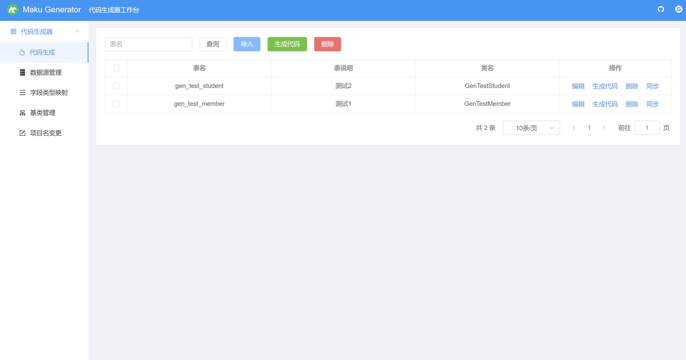
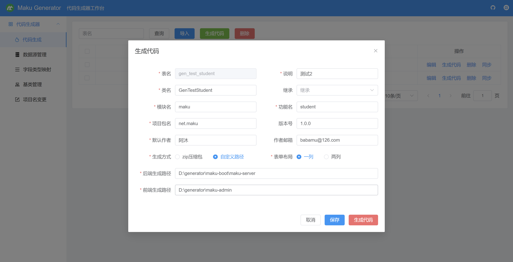
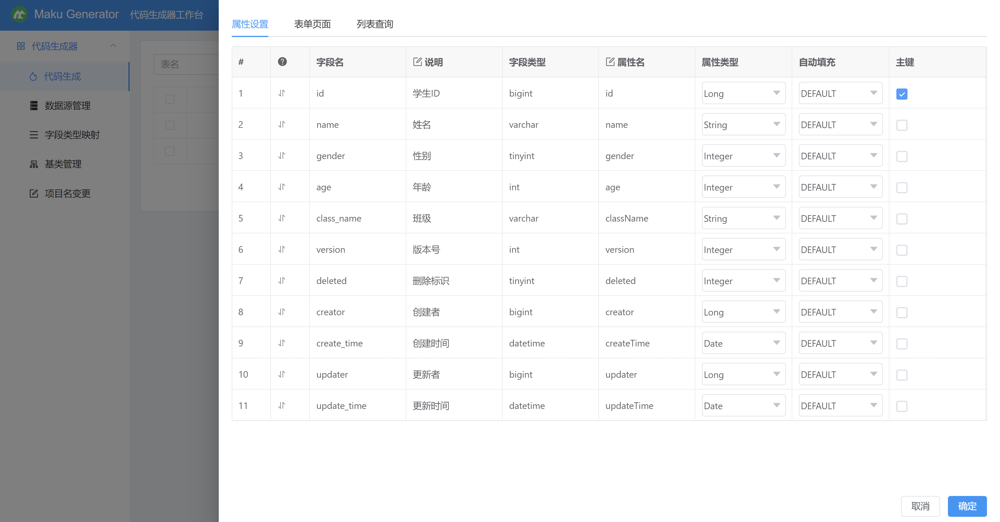
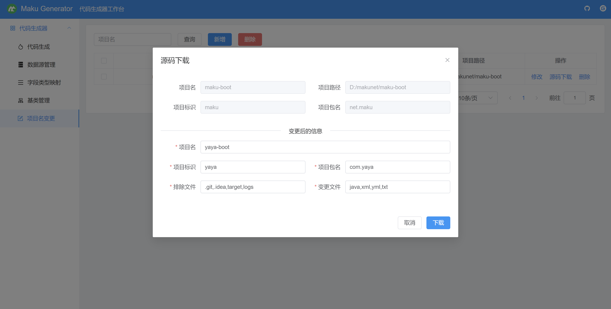

## 项目说明

- maku-generator是一款低代码生成器，可根据自定义模板内容，快速生成代码，可实现项目的快速开发、上线，减少重复的代码编写，开发人员只需专注业务逻辑即可。
- 开发文档：https://maku.net/docs/maku-generator
- 演示环境：https://demo.maku.net/maku-generator

## 项目特点

- 友好的代码结构及注释，便于阅读及二次开发
- 支持spring boot starter，能很方便集成到第三方项目
- 支持通过配置数据源，快速生成CRUD代码，减少重复工作
- 支持MySQL、Oracle、SQLServer、PostgreSQL、达梦8等主流的数据库
- 支持第三方Java项目包名修改，修改包名变得简单快速
- 支持批量导入表、批量生成代码以及同步表结构等功能

## 本地启动

- 通过git下载源码
- 如使用MySQL8.0（其他数据库类似），则创建数据库maku_generator，数据库编码为utf8mb4
- 执行db/mysql.sql文件，初始化数据
- 修改application.yml，更新MySQL账号和密码、数据库名称
- 运行GeneratorApplication.java，则可启动项目
- 项目访问路径：http://localhost:8088/maku-generator/index.html

## maven依赖引入

### SpringBoot 2.x，依赖如下：

```xml
<dependency>
    <groupId>net.maku</groupId>
    <artifactId>maku-generator-boot-starter</artifactId>
    <version>2.1.1</version>
</dependency>
```

### SpringBoot 3.x，依赖如下：

```xml
<dependency>
    <groupId>net.maku</groupId>
    <artifactId>maku-generator-boot-starter</artifactId>
    <version>3.0.1</version>
</dependency>
```

## 交流和反馈

- 官网地址：https://maku.net
- Gitee仓库：https://gitee.com/makunet/maku-generator
- Github仓库：https://github.com/makunet/maku-generator

## 微信交流群

为了更好的交流，我们新提供了微信交流群，需扫描下面的二维码，关注公众号，回复【加群】，根据提示信息，作者会拉你进群的，感谢配合！


## 支持

如果觉得框架还不错，或者已经在使用了，希望你可以去 [Github](https://github.com/makunet/maku-generator)
或 [Gitee](https://gitee.com/makunet/maku-generator) 帮作者点个 ⭐ Star，这将是对作者极大的鼓励与支持。

## 效果图







